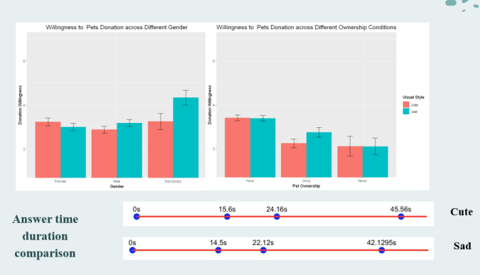

## [1. \[R\] Analysis of the Visual Style Impact on Pets Donation’s Willingness](https://github.com/CaraZhou2023/Analysis-of-Email-Visual-Style-Impact.git) | April 2024
This project is to evaluate the effectiveness of different visual styles of emails for animal shelter donations and provide insights for animal shelter's marketing strategies.

- Tools & Skills: R, Qualtrics, Survey Design, A/B Testing

- Achievements/Findings:
  - Discovered a significant impact of the pet ownership of participants on their willingness to donate; Collaboration with pet supply stores and veterinary hospitals might contribute to more donation.

**Survey Result EDA**

---
## 2. \[Python\] Assessing Operating Profitability's Influence on Excess Returns Across Firm Sizes | April 2024
The goal is to testify whether OP (Operating Profitability) is a powerful explaining factor for excess return of the stock market across firm sizes and compare our results to the bivariate-sort portfolios with the same factors from Kenneth R. French website.

- Tools & Skills: Python, Excel (Visualization)

- Achievements/Findings:
  - The average excess returns increase with the growth of OP, this trend is consistent across size categories.
  - High OP portfolios tend to perform better when value stocks outperform growth stocks
  - The portfolios with large-size companies with show the least variance with lower returns.

**Excess Retur of Portfolios Formed on Size and OP**

*In the table, the OP1 represents the portfolio groups with lowest OP values and OP5 with the highest. The same rule applies to the size (ME) grouping. The “Trends” column is the line charts of the excess average return for OP1-OP5 for each size group. The “L-S” represents long-short portfolios.*

---

## [3. \[Python\] Identifying Mental Health Issues in the Tech Industry](https://github.com/CaraZhou2023/Identifying-Mental-Health-Issues-in-the-Tech-Industry.git) | February 2024
The goal of this project is to predict if an employee should seek treatment based on the selected features from the survey.

- Tools & Skills: Python (Pandas, Sklearn, Seaborn, and Matplotlib), Data Cleaning and Preprocessing, Prediction Modeling, Model evaluation.

- Achievements/Findings:
  - Utilized hyperparameter tuning to improve F1 score to 0.85 using a Logistic Regression model.
  - Identify 3 key features ("judgement of the extent to which mental illness may interfere with work", "the presence of a family history of mental illness", and "the number of employees in the company") to predict employees’ mental health.

**Model Evaluation Table**

---
